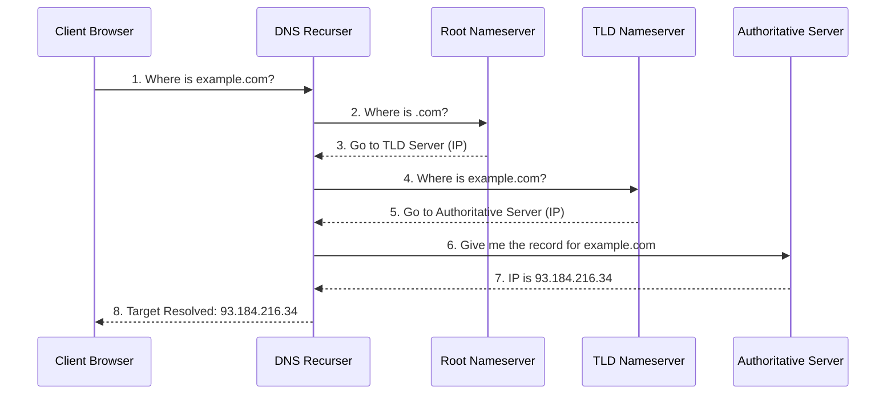

# Domain Name System (DNS)

DNS is the decentralized hierarchical naming system responsible for translating human-readable domain names (like `google.com`) into machine-readable [[IP Address|IP Addresses]] (like `142.250.190.46`).

---

## 🗺️ The DNS Hierarchy
When a DNS query is made, it traverses a strict tree-like database hierarchy from top to bottom:

1. **Root Nameservers (`.`)**: The top of the tree. Redirects queries to the correct TLD server based on the suffix.
2. **TLD Nameservers (Top-Level Domain)**: Manages extensions like `.com`, `.org`, or `.net`. Redirects traffic to the Authoritative server.
3. **Authoritative Nameservers**: The final stop. Holds the actual target mapping database record for the specific domain name.

---

## 🔄 The Resolution Lifecycle (Lookup Flow)
When you type a URL into a web browser, the system performs the following sequence to locate the server:

---

## 🗂️ Crucial DNS Record Types
As a backend developer, you will frequently configure these structural records:

- **A Record**: Maps a domain string directly to an IPv4 address.
- **AAAA Record**: Maps a domain string directly to an IPv6 address.
- **CNAME (Canonical Name)**: Aliases one domain name to another domain name (forwarding traffic).
- **MX Record (Mail Exchanger)**: Specifies the mail servers responsible for accepting email on behalf of the domain.
- **TXT Record**: Holds arbitrary text metadata (commonly used for domain ownership verification like SSL or email security).

---

## ⚡ Caching Layers
To prevent millions of repeated global network roundtrips, DNS responses are aggressively cached at multiple levels using a **TTL (Time to Live)** expiration value:
- Browser Cache
- Operating System Cache
- Local Router Cache
- ISP / DNS Recurser Cache (e.g., Cloudflare `1.1.1.1` or Google `8.8.8.8`)

---
## 🔗 Connected Nodes
- [[IP Address]] *(The target destination data)*
- [[Internet Fundamentals]] *(The master blueprint)*
- [[UDP]] *(The lightweight transport layer protocol DNS relies on)*
