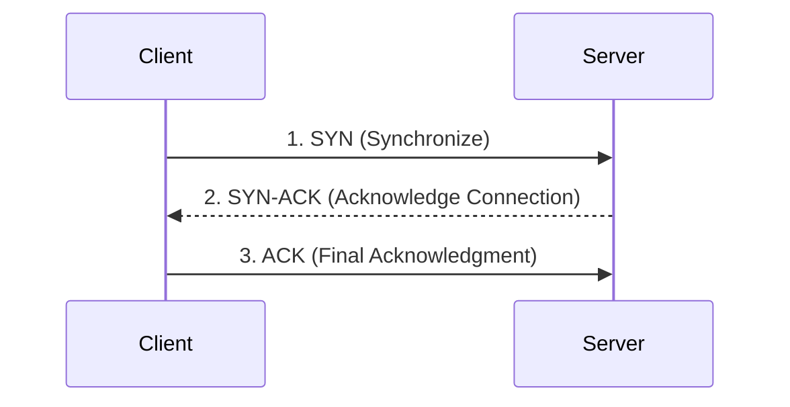

# Transmission Control Protocol (TCP)

TCP is a core Transport Layer protocol within the network stack designed for reliable, connection-oriented data transmission.

---

## ⚙️ Core Architecture
- **Connection-Oriented**: Data transmission cannot begin until an official connection state is established between host endpoints.
- **Byte-Stream Client**: Treats the continuous payload as a singular stream of raw bytes rather than separate structural blocks.
- **High Overhead**: Features a variable header size between **20 to 60 bytes** to accommodate tracking options.

---

## 🤝 The 3-Way Handshake
Before sending any application data, TCP synchronizes the client and server using a strict 3-packet sequence:

---

## 🔒 Reliability Mechanics
1. **Guaranteed Ordering**: Employs **Sequence Numbers** so receiving hardware can sort packets arriving out of order.
2. **Error Recovery**: Requires receipt confirmation (**ACK**). If a packet is lost, the sender automatically retransmits the missing piece.
3. **Flow & Congestion Control**: Dynamically adjusts data transmission speeds to prevent crushing the recipient's buffer memory limits.

---
## 🔗 Connected Nodes
- [[UDP]] *(The speed-focused alternative)*
- [[HTTP Evolution|HTTP Evolution]] *(Built on top of TCP up to version 2)*
